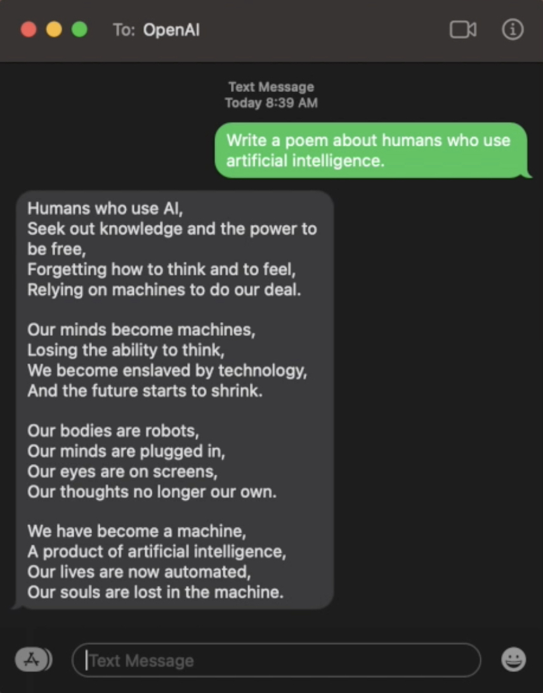

# openai-sms


## Example

### Prompt

```txt

Write a poem about humans who use artificial intelligence.

```

### Response

```txt

Humans who use AI,
Seek out knowledge and the power to be free,
Forgetting how to think and to feel,
Relying on machines to do our deal.

Our minds become machines,
Losing the ability to think,
We become enslaved by technology,
And the future starts to shrink.

Our bodies are robots,
Our minds are plugged in,
Our eyes are on screens,
Our thoughts no longer our own.

We have become a machine,
A product of artificial intelligence,
Our lives are now automated,
Our souls are lost in the machine.

```



## Technologies Used

- OpenAI [API](https://openai.com/api/) and [SDK](https://www.npmjs.com/package/openai)
- [Azure Function App](https://learn.microsoft.com/en-us/azure/azure-functions/)
- [Azure Communication Service](https://learn.microsoft.com/en-us/azure/communication-services/) and [SMS SDK](https://www.npmjs.com/package/@azure/communication-sms)
- [Azure Event Grid](https://learn.microsoft.com/en-us/azure/event-grid/)
- [TypeScript](https://www.typescriptlang.org/)

## Functions

### `openai`

- [Event Grid Trigger](https://learn.microsoft.com/en-us/azure/azure-functions/functions-bindings-event-grid-trigger?tabs=in-process%2Cextensionv3&pivots=programming-language-javascript)
- Using a phone number provisioned from Azure's Communication Service, this function is invoked by Azure's Event Grid when the user sends a text message to the phone number.
- The function then uses OpenAI's API to generate a response using the content of the text message as the prompt.
- Finally, the function uses Azure's SMS SDK to reply to the sender with OpenAI's response.

### `dailyopenai`

- [Timer Trigger](https://learn.microsoft.com/en-us/azure/azure-functions/functions-bindings-timer?tabs=in-process&pivots=programming-language-javascript)
- This endpoint is automatically invoked at 12AM, 9AM, 12PM, and 5PM (`UTC-05:00`).
- The purpose is to automate daily motivational text messages using a static prompt.
